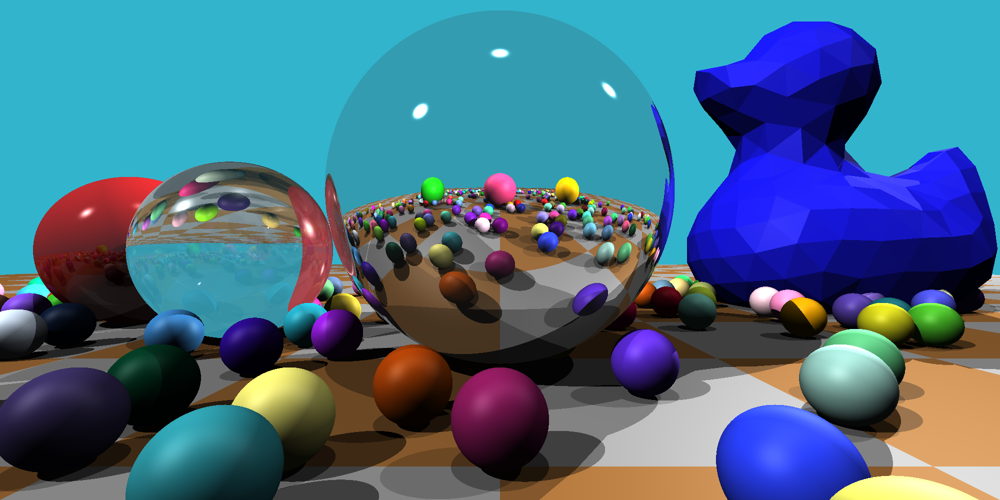
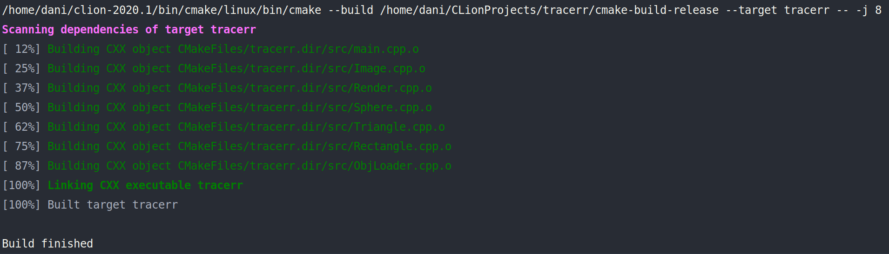
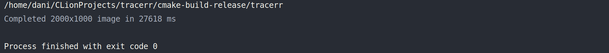

# Tracerr
## A simple raytracing program

### Overview
This program was done as the final project for the Udacity C++ Nanodegree.  
The program supports rendering of spheres, triangles and rectangles as basic primitive shapes. It also includes the capability to render .obj 3D models.  
The program is capable of simulating not only the basic Phong illumination model (ambient, diffusion and specular light) but also shadows, reflections and refractions  
The code is inspired by [tinytracer](https://github.com/ssloy/tinyraytracer) by Dimitry Sokolov (specially some of the math behind raytracing). The rest of the code was done to practice the stuff that was covered during the nanodegree.    
I also chose to use Eigen for the linear algebra due to its easy to use, speed and built-in methods. 

### How to run
First you will need to install [Eigen](http://eigen.tuxfamily.org/index.php?title=Main_Page) for the linear algebra operations  
 - Ubuntu: `sudo apt-get install libeigen3-dev`  
 - Other platforms: [Eigen website]()

It also uses the [STB library](https://github.com/nothings/stb) to encode the image files. The required files are already included in the repo (_include_ directory)  

Choose the parameters that you desire within the _main.cpp_ file (image size, scene to render, etc...)  
**NOTE**: bear in mind that in a i7 Skylake machine it takes around 25s to render the demo scene shown in the cover image above (2000px x 1000px) (400 randomly generated spheres + 3D duck model)   
For **faster execution** reduce the number of randomly generated spheres or reduce the resolution (_main.cpp_ file - lines 24 - 26). You can also comment out the 3D duck rendering (main.cpp file - line 76)  
For **single thread execution**, go to _main.cpp_ and swap the comments on lines 74 & 76   

Once you have it installed you can compile with CMake and Make  
**NOTE**: This code uses C++17 features  
`mkdir build  `  
`cd build  `  
`cmake ..  `  
`make  `  
`./tracerr`    
The resulting image will be saved in the build directory under the filename that you specify ("_RenderTest.png_" as default)

### Code Overview
The include folder contains the STB library files  
The obj folder contains a sample 3D model to test the triangle mesh rendering  
The src folder contains most of the code  
The tests folder contains the gtest tests (WIP)  

#### Classes

##### Render
- Main class for the raytracing  
- It owns the shapes to be rendered (stored in the heap)  
- It casts a ray using an origin point + a direction unit vector  
- Then it checks if the ray intersects with anything in the scene  
- If no object is hit, the render saves the background color as the value for that pixel  
- If an object is hit, the render calculates the reflections and refractions from that object recursively by casting rays from the hit point at the reflected and refracted angles  
- To calculate shadows it checks if the hit point has line of sight with the different light sources, if not it is in a shadow  
  
- The final calculation is done by taking into account the [Phong illumination model](https://en.wikipedia.org/wiki/Phong_shading) (ambient, diffused and specular) values and reflections and refractions hits  
- The raytracing can be run in series, in parallel using [OpenMP](https://en.wikipedia.org/wiki/OpenMP) or in parallel using our own thread pool implementation   

##### Image
- Holds & owns the image bitmap (pixels_) in the heap  
- It is in charge of writing the color values to every pixel and to save the image to disk using an instance of ImageFile

##### Light
- Represents a point light source with a given intensity
  
##### Material
- Represents a given material with certain properties relating to its color, diffusivity, specularity, reflectivity and refractivity

##### Shape
- Pure virtual class to define the interface for all other shapes  
- Used for dynamic polymorphism for the calculate intersection and calculate normal methods  
          

##### Sphere
- Shape child class that represents a sphere centered around a given point, with a certain radius and material  
- Since its the child of a pure virtual class it defines the relevant methods to be able to be instantiated

##### Triangle
- Shape child class that represents a triangle with three given points and a certain material. Similarly to sphere it implements its own intersection and normal calculation methods

##### Rectangle
- Shape child class made out of two triangles. Takes advantage of composition to represent a more complex shape  
   

##### ObjLoader
- Reads and parses a .obj file and creates the respective triangles for the render (including material and an optional translation)

##### ImageFile
- RAII file handler for writing png image file. Opens the file in the constructor and frees the resource in the destructor

##### ObjFile
- RAII file handler for reading the .obj file. Opens the file in the constructor and frees the resource in the destructor

##### ThreadPool
- Thread pool design pattern
- Implements a queue of work packages for a pool of threads  
- Threads take a task from the queue, run it and when they are finished, return the result and check if there are any more tasks in the queue to perform

### Rubric points
This project meets many of the rubric points but for official purposes, here are a few of them:
#### The submission must compile and run.
  

    
#### The project reads data from a file and process the data, or the program writes data to a file.
This can be seen in the _ImageFile.h_ lines 19 and 24 using `cstdio` and in the _ObjLoader.h_ file in lines 17 and 25 using `fstream`  

#### The project uses Object Oriented Programming techniques.
This can be seen in the _Shape.h_ file as it implements a pure virtual class to act as the interface for the child classes.  
 `Triangle`, `Sphere` and `Rectangle` are child classes of `Shape`  
 The project also uses dynamic polymorphism when calculating ray intersections and normal vectors (_Render.cpp_ file - lines 33 & 36)

#### The project uses scope / Resource Acquisition Is Initialization (RAII) where appropriate.
Both _ImageFile_ and _ObjFile_ classes implement RAII by acquiring the resources in the constructor and releasing them in the destructor.  
In the case of _ImageFile_, it can be seen in the _ImageFile.h_ file in lines 17 and 27

#### The project uses move semantics to move data, instead of copying it, where possible.
In _main.cpp_ a vector of unique pointers is created (line 30) and populated (lines 48-53). Since the content of the vector is unique pointers it cannot be passed by value to the render class instance, therefore it is moved to it using `std::move`

#### The project uses multithreading
The project has multithreading implemented in the `Render::RenderSceneMultiThread `method (_Render.cpp_ file - line 214). This method uses a thread pool to distribute work to different threads in a parallel way

