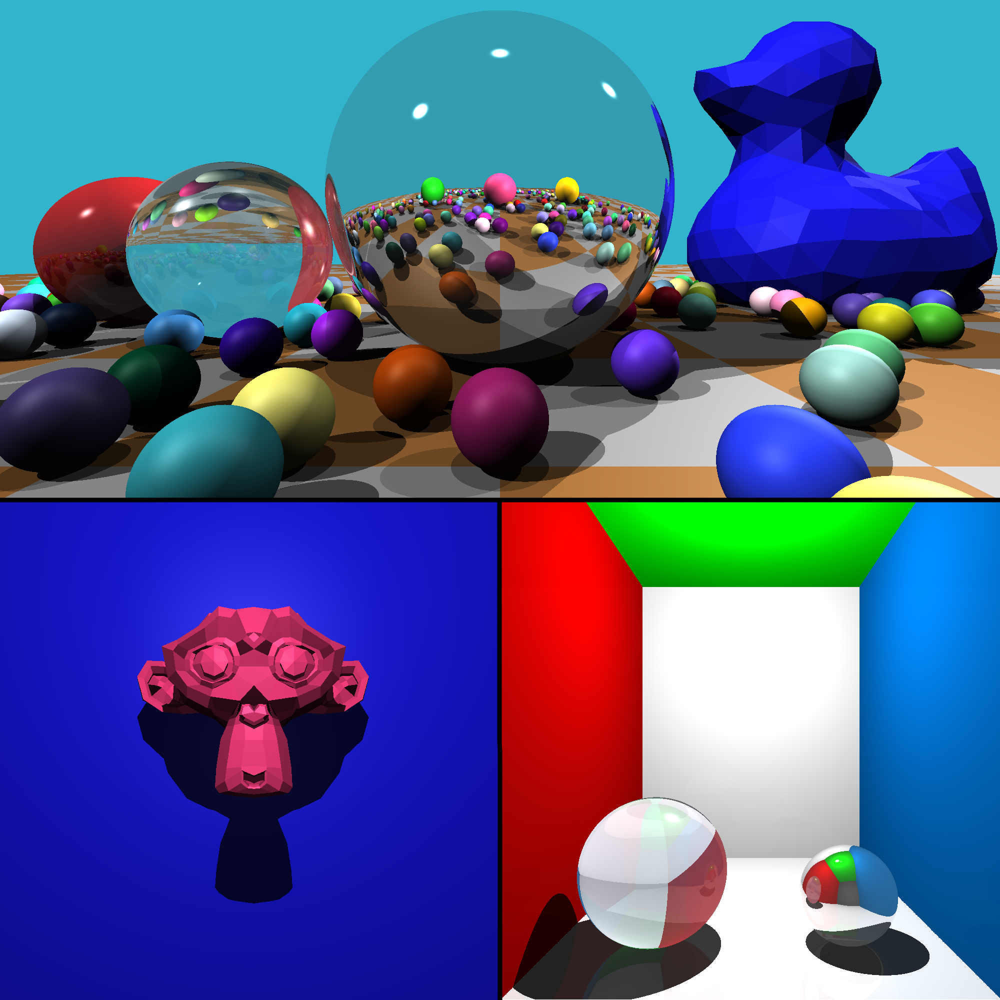
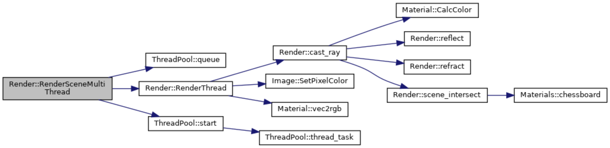
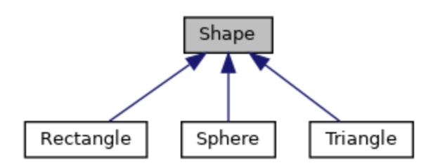
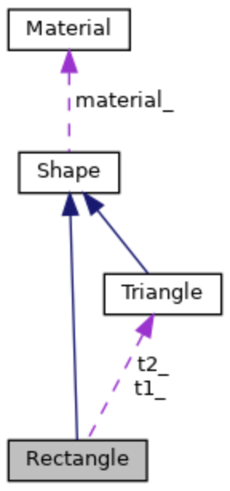

# Tracerr
## A simple raytracing program




## Overview
This program was done as the final project for the Udacity C++ Nanodegree.  
The program supports rendering of spheres, triangles and rectangles as basic primitive shapes. It also includes the capability to render .obj 3D models.  
The program is capable of simulating not only the basic Phong illumination model (ambient, diffusion and specular light) but also shadows, reflections and refractions  
The scenes to render are stored in text protobufs that can be used to modify said scenes.  
The code is inspired by [tinytracer](https://github.com/ssloy/tinyraytracer) by Dimitry Sokolov (specially some of the math behind raytracing). The rest of the code was done to practice the stuff that was covered during the nanodegree.    
I also chose to use Eigen for the linear algebra due to its easy to use, speed and built-in methods.

## Install dependencies
The instructions here are aimed for **Ubuntu** (tested on 20.04), for other platforms please check the respective library sites

Dependencies:  
1. [Git](https://git-scm.com/)
2. [CMake 3.16](https://cmake.org/)
3. [Eigen 3.3.7](http://eigen.tuxfamily.org/index.php?title=Main_Page)
4. [Protobuf 3.6.1](https://github.com/protocolbuffers/protobuf)
5. Python>=3.6 if using python

To install them run the following command:  
```sh
$ sudo apt -y install git build-essential cmake libprotobuf-dev protobuf-compiler libeigen3-dev
```

It also uses the [STB library](https://github.com/nothings/stb) to encode the image files. The required files are already included in the repo (_include_ directory)   

NOTE: If you want (**NOT REQUIRED**) to force the generation of the C++ header and source files from _scene.proto_ file, you can run the following command within the main project folder  
```sh  
$ protoc -I=./proto --cpp_out=./proto ./proto/scene.proto
```

## How to build
Once you have all the dependencies installed you can compile the program with CMake and Make
## Python
```sh
$ git clone https://github.com/DLopezMadrid/tracerr.git  
$ cd tracerr
$ pip install .
```
## C++
**NOTE**: This code uses C++17 features  
```sh
$ git clone https://github.com/DLopezMadrid/tracerr.git  
$ cd tracerr
$ mkdir build    
$ cd build    
$ cmake ..    
$ make    
```    

## How to run
To render a scene, the program is launched from the terminal and takes the `-r` option and the path to a prototext file describing the scene.  
```sh
$ ./tracerr -r {PATH_TO_PROTOTEXT_FILE}
```  
Example:
```sh
$ ./tracerr -r ./../scenes/simple.textproto
```  
The scene parameters are explained in the next section.   

In order to create a new the scene, you will need to make a new prototext file. You can ask the program to create an example scene, a commented empty template and a non-commented empty template with the following commands
```sh
  -t SAVEFILE_FOR_TEMPLATE_FILE -> Generates an empty Template with comments for a scene   
  -u SAVEFILE_FOR_UNCOMMENTED_TEMPLATE_FILE -> Generates an empty Template WITHOUT comments for a scene   
  -e SAVEFILE_FOR_EXAMPLE_SCENE -> Generates a textproto file of a Example scene and saves it to the specified file   
```  
Example to create a commented template file:
```sh
$ ./tracerr -u my_new_scene.textproto
```   


You can also find some predefined scenes in the _./scene_ folder
- simple.textproto: random scene that contains an element of every shape and an obj file
- simple_spheres.textproto: another example with just a few spheres and a custom background color
- sphere_field_with_duck.textproto: built on top of simple_spheres one but with 400 randomly generated smaller spheres and a duck 3D model
- suzanne.textproto: just a simple obj 3D model on a plain background

**NOTE**: In a i7 Skylake machine it takes around 25s to render the demo scene (_./scenes/sphere_field_with_duck.textproto_) shown in the cover image above (2000px x 1000px) (400 randomly generated spheres + 3D duck model)   

For **faster execution** you can reduce the resolution (_width_ & _height_ parameters). You can also comment out any of the shapes in the scene config file   
The resulting image will be saved in the build directory under the filename that you specify in the prototext file (_fname_ parameter)

## Python
The Python module follows the same functionality as C++ and provides the following functions:
```
tracerr.GenerateExample()
tracerr.GenerateTemplateNoComment()
tracerr.GenerateTemplate()
tracerr.RenderScene()
```
The Python module can be used as follows:
```
import tracerr
tracerr.RenderScene('PATH_TO_PROTOTEXT_FILE')
```

## Scene definition
#### Scene configuration
The protobuf schema for the scene files is defined in the _./proto/scene.proto_ file  
The following fields are mandatory
```protobuf.tmbundle
 int32 width;
 int32 height;
 bool saveFile [default = true];
```
- width: image width in pixels  
- height: image height in pixels
- saveFile: bool to specify if you wish to save the image  

There are also other scene configuration attributes that are optional
```protobuf.tmbundle
 string fname [default = "RenderTest.png"];
 bool show_elapsed_time [default = true];
 bool show_checkerboard [default = false];
 Color background_color;
 float ambient_light;
```
 - fname: filename for the saved image
 - show_elapsed_time: prints the time taken to render the scene to the console
 - show_checkerboard: draws the checkerboard floor plane
 - background_color: specifies a custom background color using the Color type (see below)
 - ambient_light: specifies the ambient light level (values 0 - 1)
 #### Supporting types
 There is a number of types created to make the object definition more structured
 ```protobuf.tmbundle
  message Pos {
     required float x = 1;
     required float y = 2;
     required float z = 3;
   }
  message Color{
    required int32 r = 1;
    required int32 g = 2;
    required int32 b = 3;
  }
  message Material{
    message Color_diff{
      required int32 r = 1;
      required int32 g = 2;
      required int32 b = 3;
    }
    message Albedo{
      required float a0 = 1;
      required float a1 = 2;
      required float a2 = 3;
      required float a3 = 4;
    }
    required Color_diff color = 1;
    required Albedo albedo = 2;
    required float specular_comp = 3;
    required float refractive_index = 4;
  }
  enum MaterialType{
    ivory = 0;
    red_rubber = 1;
    green_rubber = 2;
    blue_rubber = 3;
    orange_rubber = 4;
    pink_rubber = 5;
    red_plastic = 6;
    black_plastic = 7;
    mirror = 8;
    glass = 9;
    chessboard = 10;
  }
 ```
- Pos: defines a cartesian (X, Y, Z) position in space
- Color: defines an RGB color (0 - 255)
- Material: describes a new material containing custom diffuse color, albedo, specular component and refractive index components  
- MaterialType: if you wish to use one of the predefined materials
#### Light sources
To define a light source:
 ```protobuf.tmbundle
  message Light{
    required Pos position = 1;
    required float intensity = 2;
  }
```
Example:   
```protobuf.tmbundle
light{
  position{
    x: 0
    y: 5
    z: 0
  }
  intensity: 1.5
}
 ```

#### Spheres, triangles and rectangles
To define primitive shapes
```protobuf.tmbundle
  message Sphere{
    required Pos position = 1;
    required float radius = 2;
    optional MaterialType material = 3;
    optional bool custom_material_enabled = 4 [default = false];
    optional Material custom_material = 5;
  }
  message Triangle{
    required Pos p0 = 1;
    required Pos p1 = 2;
    required Pos p2 = 3;
    optional MaterialType material = 4;
    optional bool custom_material_enabled = 5 [default = false];
    optional Material custom_material = 6;
  }
  message Rectangle{
    required Pos p0 = 1;
    required Pos p1 = 2;
    required Pos p2 = 3;
    required Pos p3 = 4;
    optional MaterialType material = 5;
    optional bool custom_material_enabled = 6 [default = false];
    optional Material custom_material = 7;
  }

```

Examples:  
```protobuf.tmbundle
sphere{
  position{
    x: 3
    y: 0
    z: -4
  }
  radius: 0.5
  material: blue_rubber
}

triangle{
  p0{
    x: 3
    y: 3
    z: -6
  }
  p1{
    x: 3
    y: 1
    z: -6
  }
  p2{
    x: 2
    y: 2
    z: -6
  }
  material: green_rubber
}

rectangle{
  p0{
    x: -3
    y: -3
    z: -6
  }
  p1{
    x: -3
    y: -1
    z: -6
  }
  p2{
    x: -2
    y: -2
    z: -6
  }
  p3{
    x: -2
    y: -4
    z: -6
  }
  custom_material_enabled: true
  custom_material {
    color {
      r: 14
      g: 147
      b: 98
    }
    albedo {
      a0: 0.6
      a1: 0.1
      a2: 0
      a3: 0
    }
    specular_comp: 10
    refractive_index: 1
  }
}
```
#### Obj files
You can load 3D models in .obj format using the following format
```protobuf.tmbundle
  message Obj{
    required string fname = 1;
    optional MaterialType material = 2;
    optional Pos translation = 3;
    optional bool custom_material_enabled = 4 [default = false];
    optional Material custom_material = 5;
  }
```
Example:  
```protobuf.tmbundle
obj{
  fname: "./../obj/suzanne.obj"
  translation{
    x: -1
    y: 1
    z: -5
  }
  material: pink_rubber
}
```
## Code Overview
- The include folder contains the STB library files  
- The obj folder contains sample 3D models to test the triangle mesh rendering  
- The src folder contains most of the code  
- The proto folder contains the proto file defining the protobuf schema (_scene.proto_) and the generated C++ libraries to use it in the program (_scene.pb.cc_ & _scene.pb.h_)
- The scenes folder contains sample prototext files with different scenes
- The tests folder contains the gtest tests (WIP)  

### Classes

#### Render
- Main class for the raytracing  
- It owns the shapes to be rendered (stored in the heap)  
- It casts a ray using an origin point + a direction unit vector  
- Then it checks if the ray intersects with anything in the scene  
- If no object is hit, the render saves the background color as the value for that pixel  
- If an object is hit, the render calculates the reflections and refractions from that object recursively by casting rays from the hit point at the reflected and refracted angles  
- To calculate shadows it checks if the hit point has line of sight with the different light sources, if not it is in a shadow  
  
- The final calculation is done by taking into account the [Phong illumination model](https://en.wikipedia.org/wiki/Phong_shading) (ambient, diffused and specular) values and reflections and refractions hits  
- The raytracing can be run in series, in parallel using [OpenMP](https://en.wikipedia.org/wiki/OpenMP) or in parallel using our own thread pool implementation   


#### SceneManager  
- The scene manager is in charge of reading the scene from the protobuf text file, parse it, generate the required shapes sets up the render environment and call the render class  
- It can also write to text protobufs but this is not a user facing feature yet. It was implemented for learning and debugging purposes only  
- It is a friend class of Render, so it can access all the private members on it  

#### Image
- Holds & owns the image bitmap (pixels_) in the heap  
- It is in charge of writing the color values to every pixel and to save the image to disk using an instance of ImageFile

#### Light
- Represents a point light source with a given intensity

#### Material
- Represents a given material with certain properties relating to its color, diffusivity, specularity, reflectivity and refractivity

#### Shape
- Pure virtual class to define the interface for all other shapes  
- Used for dynamic polymorphism for the calculate intersection and calculate normal methods  
          

#### Sphere
- Shape child class that represents a sphere centered around a given point, with a certain radius and material  
- Since its the child of a pure virtual class it defines the relevant methods to be able to be instantiated

#### Triangle
- Shape child class that represents a triangle with three given points and a certain material. Similarly to sphere it implements its own intersection and normal calculation methods

#### Rectangle
- Shape child class made out of two triangles. Takes advantage of composition to represent a more complex shape  
   

#### ObjLoader
- Reads and parses a .obj file and creates the respective triangles for the render (including material and an optional translation)

#### ImageFile
- RAII file handler for writing png image file. Opens the file in the constructor and frees the resource in the destructor

#### ObjFile
- RAII file handler for reading the .obj file. Opens the file in the constructor and frees the resource in the destructor

#### ThreadPool
- Thread pool design pattern
- Implements a queue of work packages for a pool of threads  
- Threads take a task from the queue, run it and when they are finished, return the result and check if there are any more tasks in the queue to perform

## License

This project is distributed under the [DO WHAT THE FUCK YOU WANT TO PUBLIC LICENSE](https://en.wikipedia.org/wiki/WTFPL).
